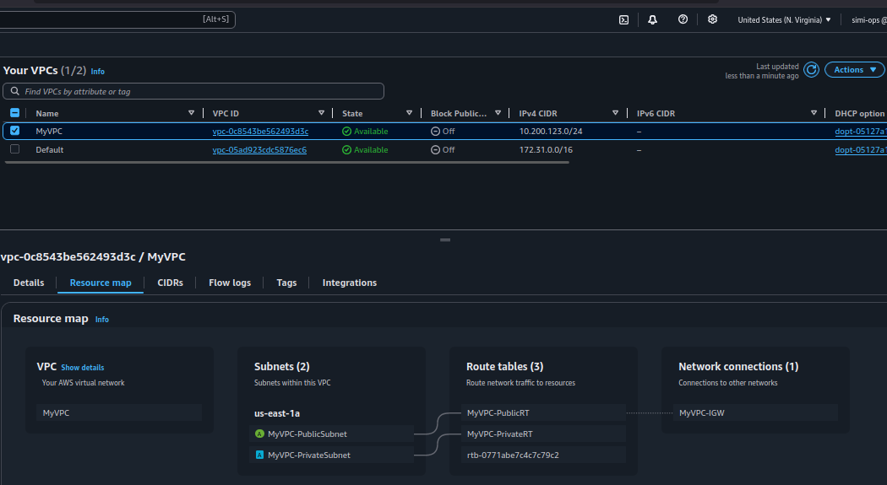

# VPC Deployment Project

This project deploys a basic AWS VPC with one public and one private subnet using CloudFormation.

## Architecture

- VPC with CIDR block 10.200.123.0/24
- Public subnet (10.200.123.0/26) with Internet Gateway access
- Private subnet (10.200.123.64/26)
- Route tables for both subnets

## Deployment

1. Ensure AWS CLI is configured with appropriate credentials
2. Run the deployment script:

```bash
./bin/deploy
```

## Configuration

Edit the variables in `bin/deploy` to customize:
- AWS Region
- Availability Zone
- CIDR blocks
- Stack name

## Files

- `vpc.yaml` - CloudFormation template
- `bin/deploy` - Deployment script